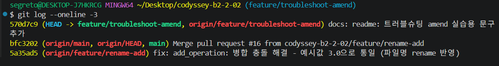
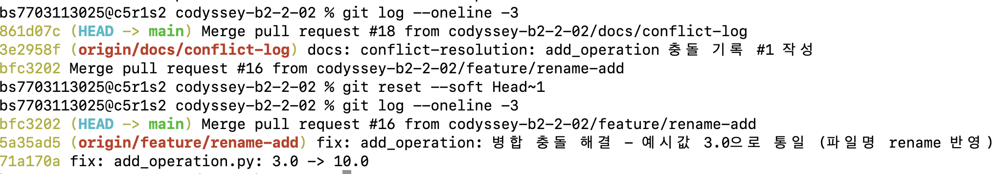
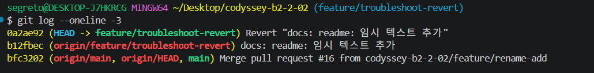

# Troubleshooting Log

> 팀 전체가 아래 4가지 시나리오를 모두 수행. 팀원별 최소 1개 시나리오에는 참여(이름/역할 명시) 필수.

## 시나리오: git commit --amend (최근 커밋 메시지 수정)

### 참여자

- 김문정

### 상황

- README.md에 실습용 변경을 커밋했는데, 커밋 메시지가 "docs: readme 수정"처럼 구체성이 없어서 컨벤션에 맞게 다시 작성이 필요했음

### 시도한 명령/절차

- `git commit -m "docs: readme 수정"`
- `git commit --amend -m "docs: readme: 트러블슈팅 amend 실습용 문구 추가"`

### 결과

```
570d7c9 (HEAD -> feature/troubleshoot-amend) docs: readme: 트러블슈팅 amend 실습용 문구 추가
bfc3202 (main) Merge pull request #16 from codyssey-b2-2-02/feature/rename-add
```



- 새 커밋이 추가되지 않고, 직전 커밋(570d7c9)의 메시지만 교체됨
- 주의점: 이미 push된 커밋을 amend하면 해시가 바뀌므로 공유 브랜치에서는 사용하지 않고 개인 작업 브랜치에서만 사용함

### 왜 이 방법을 선택했는가 (Why)

- 아직 아무도 pull받지 않은 개인 브랜치의 최신 커밋이라, 새 커밋을 추가하기보다 기존 커밋을 정정하는 게 히스토리를 더 깔끔하게 유지하는 방법이었음

---

## 시나리오: git reset --soft HEAD~1 (로컬 커밋 취소 + 변경 유지)

### 참여자

- 김상원

### 상황

- add_operation.py의 예시값을 실수로 3.0에서 10.0으로 되돌리는 커밋(71a170a)을 로컬에서 만들었는데, 아직 push하지 않은 상태라 이 커밋만 취소하고 변경 내용은 다시 검토하고 싶었던 상황

### 시도한 명령/절차

- `git reset --soft HEAD~1`

### 결과

```
bfc3202 (HEAD -> main) Merge pull request #16 from codyssey-b2-2-02/feature/rename-add
5a35ad5 (origin/feature/rename-add) fix: add_operation: 병합 충돌 해결 - 예시값 3.0으로 통일 (파일명 rename 반영)
71a170a fix: add_operation.py: 3.0 -> 10.0
```



- Reset 전: 로컬 브랜치가 origin/main보다 1개 커밋(71a170a) 앞서 있었음
- Reset 후: 로컬 브랜치 포인터가 원격 저장소의 최상단 커밋(origin/main, bfc3202) 위치로 이동
- 커밋만 취소되고, 작성한 코드 변경사항은 Staged(Changes to be committed) 상태로 유지됨

### 왜 이 방법을 선택했는가 (Why)

- 아직 push하지 않은 로컬 전용 커밋이라 안전하게 취소 가능했고, 변경 내용 자체는 지우지 않고 다시 검토할 수 있도록 유지하고 싶어서 reset --soft를 선택함

---

## 시나리오: git revert (원격에 push된 커밋 취소)

### 참여자

- 김문정

### 상황

- README.md에 실습용으로 "임시 텍스트"를 추가해 커밋·push까지 완료한 상태에서, 이미 원격에 공유된 이 변경을 취소해야 했음

### 시도한 명령/절차

- `git commit -m "docs: readme: 임시 텍스트 추가"` (b12fbec)
- `git push`
- `git revert HEAD --no-edit` (0a2ae92)

### 결과

```
0a2ae92 (HEAD -> feature/troubleshoot-revert) Revert "docs: readme: 임시 텍스트 추가"
b12fbec (origin/feature/troubleshoot-revert) docs: readme: 임시 텍스트 추가
bfc3202 (main) Merge pull request #16 from codyssey-b2-2-02/feature/rename-add
```



- 기존 커밋(b12fbec)은 삭제되지 않고 그대로 남고, 그 변경을 취소하는 새 커밋(0a2ae92)이 위에 추가됨
- README.md 내용은 추가 이전 상태로 복원됨

### 왜 이 방법을 선택했는가 (Why)

- 이미 원격에 공유된 커밋이라, reset으로 히스토리를 지우면 다른 사람이 pull받았을 때 충돌·혼란을 일으킬 수 있어 안전한 revert를 선택함

---

## 시나리오: git stash / git stash pop (작업 보관 후 전환)

### 참여자

- 이아인

### 상황

- 로컬 feature/sum 브랜치에서 sum.py 파일을 개발중에 팀원의 .github/CODEOWNERS 수정으로 인한 new commit & push가 발생하면서 공통 적용 요청 받으면서 작업하던 내용을 임시 저장하고 로컬 main 브랜치를 업데이트해야 하는 상황.

### 시도한 명령/절차

- `git stash` → `git stash pop`

```shell
# 임시 저장
git stash

# main 브랜치 업데이트(팀원의 변경사항 반영)
git switch main
git fetch origin main
git pull origin main

# 본래 브랜치로 복귀
git switch feature/sum
# 임시저장했던 내용 불러오고 목록에서 제거
git stash pop
```

### 결과

- 임시저장해두었던 코드 변경사항이 잘 원복되어 작업을 이어서 할 수 있었음
- main 브랜치의 최신 변경사항도 독립적으로 로컬에 업데이트 되어 있음을 확인함

### 왜 이 방법을 선택했는가 (Why)

- 작업중이던 코드의 변경사항이 완료되지 않아 커밋을 하기에는 적절하지 않은 상황이었으므로 git stash로 임시저장 함
